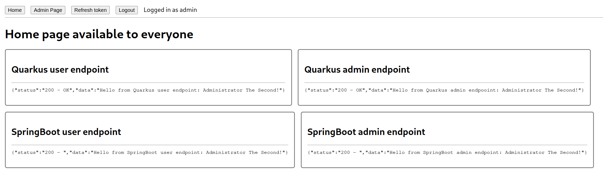
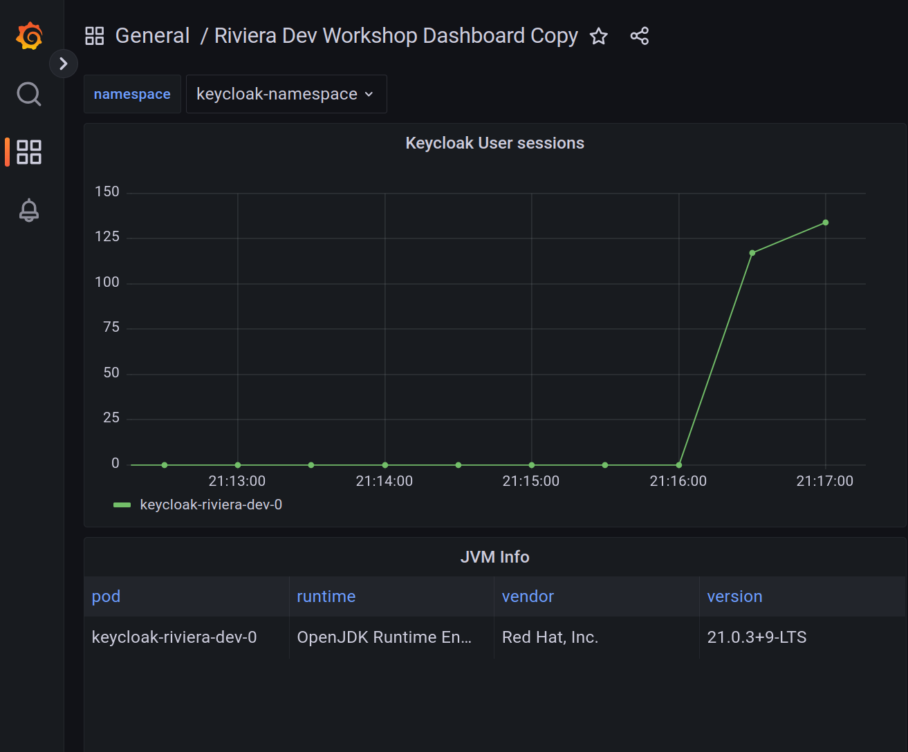

# Keycloak K8s workshop

This workshop provides an example of how to deploy a Keycloak server on Kubernetes and use it to secure the following applications
- Quarkus with OIDC extension
- SpringBoot with spring-security
- React frontend that communicates with both backend applications

It provides two ways on how to follow instructions:

##  Automated deployments

All steps are automated. This can be used to quickly setup the environment without any manual steps.

### Prerequisites

- kubectl ([Installation guide here](https://kubernetes.io/docs/tasks/tools/#kubectl)
- Minikube ([Installation guide here](https://minikube.sigs.k8s.io/docs/start/))
- jq ([Installation guide here](https://jqlang.github.io/jq/))
- Taskfile ([Installation guide here](https://taskfile.dev/installation/))
- OpenSSL for creating certificates

## Manual deployment

All steps are done manually and are described in this guide. 
It is recommended to use Minikube for manual deployment as well as it is easier to configure all configurations like Ingress and realm configuration because we assume the app hosts are in form of `app-name.${namespace}.${minikube-ip}.nip.io`. 
It should be possible to use the steps with any Kubernetes cluster, however, you need to replace hosts manually everywhere.
Each place that needs the change should be mentioned in the guide.

### Prerequisites

- kubectl ([Installation guide here](https://kubernetes.io/docs/tasks/tools/#kubectl)
- jq ([Installation guide here](https://jqlang.github.io/jq/))
- OpenSSL for creating certificates

## Workshop steps

Below you can find the steps of the workshop that contain both manual and automated steps.

### Prepare Kubernetes environment

This workshop requires Kubernetes environment that supports Ingress. 

#### Minikube setup

To start Minikube and enable Ingress, execute the following command:

[Automated]
```bash
task prepare-minikube
```

[Manual]
```bash
minikube start
minikube addons enable ingress
minikube addons enable ingress-dns
```

### Deploying Keycloak

This step deploys Keycloak operator, Postgres database, Keycloak server and a Keycloak realm names `riviera-dev-realm` with all necessary resources.

#### [Automated]

```bash
task keycloak-deploy-all
```

#### [Manual]


1. Create a namespace for Keycloak
    ```bash
    kubectl create namespace keycloak-namespace
    ```
2. Deploy Keycloak operator - this deploys Keycloak operator version 25.0.1
    ```bash
    kubectl -n keycloak-namespace apply -f https://raw.githubusercontent.com/keycloak/keycloak-k8s-resources/refs/tags/25.0.1/kubernetes/keycloaks.k8s.keycloak.org-v1.yml
    kubectl -n keycloak-namespace apply -f https://raw.githubusercontent.com/keycloak/keycloak-k8s-resources/refs/tags/25.0.1/kubernetes/keycloakrealmimports.k8s.keycloak.org-v1.yml
    kubectl -n keycloak-namespace apply -f https://raw.githubusercontent.com/keycloak/keycloak-k8s-resources/refs/tags/25.0.1/kubernetes/kubernetes.yml
    ```
3. Deploy Postgres database - this deploys PostgreSQL database that will be used as Keycloak storage. Also, create Kubernetes Secret with the database credentials.
    ```bash
    kubectl -n keycloak-namespace apply -f keycloak/k8s-resources/postgres.yaml
    kubectl -n keycloak-namespace create secret generic keycloak-db-secret --from-literal=username=testuser --from-literal=password=testpassword
    ```
4. We will configure TLS for Keycloak and therefore, we need to create a Kubernetes Secret with a certificate and a key.
    1. Create a self-signed certificate using OpenSSL, for this step it is necessary to replace `KEYCLOAK_URL` and `KEYCLOAK_IP` with actual values. For Minikube the values are: `KEYCLOAK_URL`=`keycloak.keycloak-namespace.$(minikube ip).nip.io` and `KEYCLOAK_IP`=`$(minikube ip)`.
       ```bash
       export KEYCLOAK_IP=$(minikube ip)
       export KEYCLOAK_URL=keycloak.keycloak-namespace.${KEYCLOAK_IP}.nip.io
       openssl req -subj "/CN=${KEYCLOAK_URL}/O=Test Keycloak./C=US" -addext "subjectAltName = IP:${KEYCLOAK_IP}, DNS:${KEYCLOAK_URL}" -newkey rsa:2048 -nodes -keyout keycloak_key.pem -x509 -days 365 -out keycloak_certificate.pem
       ```
    2. Create a Kubernetes Secret with the certificate and key. Note that `keycloak-tls-secret` is the name of the secret that will be used in the Keycloak deployment later.
       ```bash
       kubectl -n keycloak-namespace create secret tls keycloak-tls-secret --cert=keycloak_certificate.pem --key=keycloak_key.pem
       ```
    3. Later in the workshop, we need to configure applications to trust this certificate, therefore we will prepare JKS truststore named `i-trust-keycloak.jks`. Note `KEYCLOAK_URL` is the same as in the previous step.
         ```bash
         openssl x509 -outform der -in keycloak_certificate.pem -out keycloak_certificate.der
         keytool -import -alias ${KEYCLOAK_URL} -keystore i-trust-keycloak.jks -file keycloak_certificate.der -storepass password -noprompt
         ```
5. Deploy Keycloak server to Kubernetes. Before deploying, the file `keycloak/k8s-resources/keycloak.yaml` needs to contain correct Keycloak host.
   - For Minikube, replace hosts using `envsubst` command using the following.
     ```bash
     NAMESPACE=keycloak-namespace MINIKUBE_IP=$(minikube ip) envsubst < keycloak/k8s-resources/keycloak.yaml | kubectl -n keycloak-namespace apply -f -
     ```
   - For other Kubernetes clusters, replace host manually in the file `keycloak/k8s-resources/keycloak.yaml` on line with comment `REPLACE WITH KEYCLOAK_URL`.
     ```bash
     kubectl -n keycloak-namespace apply -f keycloak/k8s-resources/keycloak.yaml
     ```
6. Wait until Keycloak is ready. You can use the following command that will do the waiting for you.
    ```bash
    kubectl -n keycloak-namespace wait --for=condition=Ready --timeout=180s keycloaks.k8s.keycloak.org/keycloak-riviera-dev
    ```
7. This workshop assumes there is no TLS termination on the proxy configured. At the moment, there seems to be a bug in Minikube and therefore we need to use a workaround to make Ingress advertise the correct certificate by the following command. Make sure you replace `KEYCLOAK_URL` the same way as in the previous steps.
   - For Minikube execute the following command.
     ```bash
     NAMESPACE=keycloak-namespace MINIKUBE_IP=$(minikube ip) envsubst < keycloak/k8s-resources/keycloak-ingress-tls-patch.yaml > ingress-patch-replaced.yaml
     kubectl -n keycloak-namespace patch ingress keycloak-riviera-dev-ingress --patch-file ingress-patch-replaced.yaml
     ```
   - For other Kubernetes clusters replace `KEYCLOAK_URL` manually in the file `keycloak/k8s-resources/keycloak-ingress-tls-patch.yaml` and execute the following command.
     ```bash
     kubectl -n keycloak-namespace patch ingress keycloak-riviera-dev-ingress --patch-file keycloak/k8s-resources/keycloak-ingress-tls-patch.yaml
     ```
8. Create Keycloak realm with all necessary resources. This step creates:
   - Realm `riviera-dev-realm`
   - Clients for all application we will use in this workshop
   - Roles `admin` and `user`
   - Users `admin` (with roles `user` and `admin`) and `user` (with role `user`) with passwords `admin` and `user`.
   
   Keycloak needs to be aware of locations of each application it is securing, therefore the file `keycloak/k8s-resources/keycloak-realm-import.yaml` needs to be updated with the actual URLs.

   - For Minikube execute the following command.
     ```bash
     NAMESPACE=keycloak-namespace MINIKUBE_IP=$(minikube ip) envsubst < keycloak/k8s-resources/keycloak-realm-import.yaml | kubectl -n keycloak-namespace apply -f -
     ```
   - For the other Kubernetes clusters update URLs manually. Note this step can be done later in the Keycloak admin console. Look for the comment `# REPLACE WITH [APPLICATION]_URL` and replace the URLs with actual values. Note the comment sometimes contains information to append `/*` to the URL. 
   Then execute the following command:
     ```bash
     kubectl -n keycloak-namespace apply -f keycloak/k8s-resources/keycloak-realm-import.yaml
     ```
   
#### Validate Keycloak deployment

Obtain the Keycloak URL and credentials by executing the following command (for [Automated] deployments this is printed automatically):
```bash
echo "Access Keycloak on https://$(kubectl -n keycloak-namespace get ingress/keycloak-riviera-dev-ingress -o jsonpath='{.spec.rules[0].host}')"
echo "Username:" $(kubectl -n keycloak-namespace get secrets keycloak-riviera-dev-initial-admin -o=jsonpath='{.data.username}' | base64 -d)
echo "Password:" $(kubectl -n keycloak-namespace get secrets keycloak-riviera-dev-initial-admin -o=jsonpath='{.data.password}' | base64 -d)
```

Access Keycloak on the printed URL and login with the printed credentials. You should be able to access Keycloak admin console and `riviera-dev-realm` should be available if created. 

#### Obtain Keycloak token that can be later used to test APIs

Obtain token for both users by executing the following commands:
```bash
export KEYCLOAK_URL=$(kubectl -n keycloak-namespace get ingress/keycloak-riviera-dev-ingress -o jsonpath='{.spec.rules[0].host}')
export USER_TOKEN=$(curl -s --insecure -X POST https://$KEYCLOAK_URL/realms/riviera-dev-realm/protocol/openid-connect/token \
    -u 'quarkus-oidc-extension:1LZ65XcapsfnwEOLsByUW7KKv05mGsZF' \
    -H "content-type: application/x-www-form-urlencoded" \
    -d "username=user&password=user&grant_type=password" | jq --raw-output '.access_token')
export ADMIN_TOKEN=$(curl -s --insecure -X POST https://$KEYCLOAK_URL/realms/riviera-dev-realm/protocol/openid-connect/token \
    -u 'quarkus-oidc-extension:1LZ65XcapsfnwEOLsByUW7KKv05mGsZF' \
    -H "content-type: application/x-www-form-urlencoded" \
    -d "username=admin&password=admin&grant_type=password" | jq --raw-output '.access_token')
```

### Deploying Quarkus with OIDC extension

This step deploys a Quarkus with OIDC extension that is secured by Keycloak.

#### Prerequisites

This step requires additional prerequisites:
- Java 17

#### [Automated]

```bash
task quarkus-deploy-all
```

#### [Manual]

1. Change directory to quarkus-oid-extension.
    ```bash
    cd quarkus-oidc-extension
    ```
2. If you are not using Minikube, it is necessary to do some configuration changes in [`application.properties` file](https://github.com/mhajas/keycloak-workshop/blob/main/quarkus-oidc-extension/src/main/resources/application.properties).
    - configure [Quarkus Kubernetes extension](https://quarkus.io/guides/deploying-to-kubernetes) to use correct image where you plan to push the Docker image that will be built in the following step. 
    - Configure Ingress host [here](https://github.com/mhajas/keycloak-workshop/blob/c585f0dca499b0b5d3d9a521c36a626ea649159a/quarkus-oidc-extension/src/main/resources/application.properties#L9-L16) to match the correct host.
    - Configure [quarkus.oidc.auth-server-url](https://github.com/mhajas/keycloak-workshop/blob/c585f0dca499b0b5d3d9a521c36a626ea649159a/quarkus-oidc-extension/src/main/resources/application.properties#L2C22-L2C30) to point to `$KEYCLOAK_URL/realms/riviera-dev-realm`.
    - Configure [`quarkus.http.cors.origins`](https://github.com/mhajas/keycloak-workshop/blob/c585f0dca499b0b5d3d9a521c36a626ea649159a/quarkus-oidc-extension/src/main/resources/application.properties#L19C3-L19C26) to match the host of the javascript-react application.
3. Build the Quarkus source code application. Note the parameters `minikube.ip` and `namespace` are usable only for Minikube and .
    ```bash
    ./mvnw install -DskipTests -Dminikube.ip=$(minikube ip) -Dnamespace=keycloak-namespace
    ```
4. Build the Docker image and push to a registry so it is available for the Kubernetes cluster. 
    For Minikube execute the following:
    ```bash
    eval $(minikube docker-env) && docker build . -t quarkus-oidc-extension:1.0.0-SNAPSHOT -f src/main/docker/Dockerfile.jvm
    ```
5. Deploy the Quarkus application to Kubernetes. This step creates a Kubernetes Deployment, Service and Ingress for the Quarkus application. Note the Kubernetes resources are automatically created by the Quarkus Kubernetes extension in step 3.
    ```bash
    kubectl -n keycloak-namespace apply -f target/kubernetes/kubernetes.yml
    ```
6. Change directory back to the root of the project.
    ```bash
    cd ..
    ```

#### Validate Quarkus deployment

Quarkus application contains 2 endpoint `/user` and `/admin`. Both are secured by Keycloak and require a valid token to access. 
`/user` is accessible by users with role `user` and `/admin` is accessible by users with role `admin`. 
You can change the endpoint and the used token in the following command to test the access.
```bash
curl -i "http://$(kubectl -n keycloak-namespace get ingress/quarkus-oidc-extension -o jsonpath='{.spec.rules[0].host}')/user" --header "Authorization: Bearer $USER_TOKEN"
```

Expected output is:

```bash
HTTP/1.1 200 OK
Date: Tue, 02 Jul 2024 18:12:32 GMT
Content-Type: text/plain;charset=UTF-8
Content-Length: 49
Connection: keep-alive
Cache-Control: no-cache

Hello from Quarkus user endpoint: User The First! 
```

### Deploying SpringBoot with spring-security

This step deploys a SpringBoot application with spring-security that is secured by Keycloak.

#### Prerequisites

This step requires additional prerequisites:
- Java 17

#### [Automated]

```bash
task spring-security-deploy
```

#### [Manual]

1. If you are not using Minikube, it is necessary to do some configuration changes. 
    - Use `KEYCLOAK_URL` in [here](https://github.com/mhajas/keycloak-workshop/blob/6fed3983afef7caabd05a660f91f78cd3b0dca91/spring-security/src/main/resources/application.yml#L6) and [here](https://github.com/mhajas/keycloak-workshop/blob/6fed3983afef7caabd05a660f91f78cd3b0dca91/spring-security/src/main/resources/policy-enforcer.json#L3).
    - Configure CORS origins to contain url of `javascript-react` application [here](https://github.com/mhajas/keycloak-workshop/blob/6fed3983afef7caabd05a660f91f78cd3b0dca91/spring-security/src/main/java/org/keycloak/quickstart/OAuth2ResourceServerController.java#L25).
2. Change directory to spring-security.
    ```bash
    cd spring-security
    ```
3. Build the SpringBoot application. Note this step also builds the Docker image.
   - For Minikube execute the following command.
     ```bash
     eval $(minikube docker-env) && ./mvnw spring-boot:build-image -DskipTests -Dminikube.ip=$(minikube ip) -Dnamespace=keycloak-namespace
     ```
   - For other Kubernetes clusters, adjust the configuration based on the step 1., execute the following command and push the built image to the registry that is accessible by the Kubernetes cluster.
     ```bash
     ./mvnw spring-boot:build-image -DskipTests
     ```
4. This application also needs to trust Keycloak certificate and therefore we need to configure truststore. The application expects the truststore to be present in a Kubernetes Secret with name `i-trust-keycloak-secret`. Create it using the following command.
    ```bash
    kubectl -n keycloak-namespace create secret generic i-trust-keycloak-secret --from-file=../i-trust-keycloak.jks
    ```
5. Create the Kubernetes resources for the SpringBoot application. This step creates a Kubernetes Deployment, Service.
   - For Minikube execute the following command. Note, thanks to `CHECKSUM` you can rebuild the image, execute the following command again and the pod will be automatically restarted.
     ```bash
     NAMESPACE=keycloak-namespace MINIKUBE_IP=$(minikube ip) CHECKSUM=$(sha256sum target/spring-security-1.0.0-SNAPSHOT.jar | awk '{ print $1 }') \
     envsubst < k8s-resources/spring-security.yaml \
     | kubectl -n keycloak-namespace apply -f -
     ```
   - For other Kubernetes clusters replace all occurrences of `# Replace with ...` comment in `k8s-resources/spring-security.yaml` and execute the following command.
     ```bash
     kubectl -n keycloak-namespace apply -f k8s-resources/spring-security.yaml
     ```
6. Change directory back to the root of the project.
    ```bash
    cd ..
    ```

#### Validate SpringBoot deployment

Spring-security application contains 2 endpoints `/` and `/protected/premium`. Both are secured by Keycloak and require a valid token to access.
`/` is accessible by users with role `user` and `/protected/premium` is accessible by users with role `admin`.
You can change the endpoint and the used token in the following command to test the access.
```bash
curl -i -v "http://$(kubectl -n keycloak-namespace get ingress/spring-security -o jsonpath='{.spec.rules[0].host}')/" --header "Authorization: Bearer $USER_TOKEN"
```

Expected output is:

```bash
HTTP/1.1 200 
Date: Wed, 03 Jul 2024 11:31:27 GMT
Content-Type: text/plain;charset=UTF-8
Content-Length: 52
Connection: keep-alive
Vary: Origin
Vary: Access-Control-Request-Method
Vary: Access-Control-Request-Headers
X-Content-Type-Options: nosniff
X-XSS-Protection: 0
Cache-Control: no-cache, no-store, max-age=0, must-revalidate
Pragma: no-cache
Expires: 0
X-Frame-Options: DENY

Hello from SpringBoot user endpoint: User The First!% 
```

### Deploying React frontend application

This step deploys a React frontend application that communicates with both backend applications.

#### [Automated]

```bash
task javascript-react-deploy
```

#### [Manual]

1. Change directory to javascript-react.
    ```bash
    cd javascript-react
    ```
1. Build Docker image containing the React application.
   - For Minikube.
     ```bash
     eval $(minikube docker-env) && docker build -t javascript-react:1.0.0-SNAPSHOT .
     ```
   - For other Kubernetes clusters, build the image and push it to the registry that is accessible by the Kubernetes cluster.
     ```bash
     docker build -t javascript-react:1.0.0-SNAPSHOT .
     ```
2. Create the Kubernetes resources for the React application. This step creates a Kubernetes Deployment, Service and Ingress.
   - For Minikube execute the following command. Note, thanks to `CHECKSUM` you can rebuild the image, execute the following command again and the pod will be automatically restarted.
     ```bash
     NAMESPACE=keyclok-namespace MINIKUBE_IP=$(minikube ip) \
     CHECKSUM=$(find src -type f -exec sha256sum {} \; | sha256sum | awk '{ print $1 }') \
     envsubst < k8s-resources/javascript-react.yaml | kubectl -n kubernetes-namespace apply -f - 
     ```
   - For other Kubernetes clusters replace all occurrences of `# Replace with ...` comment in `k8s-resources/javascript-react.yaml` and execute the following command.
     ```bash
     kubectl -n keycloak-namespace apply -f k8s-resources/javascript-react.yaml
     ```
3. Change directory back to the root of the project.
    ```bash
    cd ..
    ```
     
#### Validate React deployment

React application is accessible on the URL printed by the following command.
```bash
echo "Access React application on http://$(kubectl -n keycloak-namespace get ingress/javascript-react -o jsonpath='{.spec.rules[0].host}')"
```
After accessing the app you should be redirected to Keycloak login page. After successful login (with users `user` or `admin`), you should be redirected back to the React application where you can see responses from Quarkus and SpringBoot applications.



### Deploying Prometheus monitoring and Grafana

This step deploys a new namespace `monitoring` that contains Prometheus and Grafana with some predefined dashboards.

#### Prerequisites

This step requires additional prerequisites:
- Helm ([installation guide here](https://helm.sh/docs/intro/install/))

#### [Automated]

```bash
task grafana-deploy
```

#### [Manual]

1. Create a namespace for monitoring.
    ```bash
    kubectl create namespace monitoring
    ```
2. Add the Prometheus Helm repository.
    ```bash
    helm repo add prometheus-community https://prometheus-community.github.io/helm-charts
    helm repo update
    ```
3. Install Prometheus and Grafana using Helm. This step will configure Grafana to be secured by Keycloak. Note this steps also created a `PodMonitor` resource for Keycloak in the namespace `keycloak-namespace`.
   - For Minikube:
     ```bash
     export KEYCLOAK_URL=https://keycloak.keycloak-namespace.$(minikube ip).nip.io
     helm upgrade --install prometheus prometheus-community/kube-prometheus-stack --version 39.11.0 -f grafana/monitoring.yaml \
        --set grafana."grafana\.ini".server.root_url=https://grafana.$(minikube ip).nip.io \
        --set grafana."grafana\.ini"."auth.generic_oauth".auth_url=${KEYCLOAK_URL}/realms/riviera-dev-realm/protocol/openid-connect/auth \
        --set grafana."grafana\.ini"."auth.generic_oauth".token_url=${KEYCLOAK_URL}/realms/riviera-dev-realm/protocol/openid-connect/token \
        --set grafana."grafana\.ini"."auth.generic_oauth".api_url=${KEYCLOAK_URL}/realms/riviera-dev-realm/protocol/openid-connect/userinfo \
        --set prometheus.prometheusSpec.retention=168h
     helm upgrade --install monitoring --set namespace=keycloak-namespace --set hostname=$(minikube ip).nip.io grafana/monitoring
     ```
    - For other Kubernetes clusters replace URLs mentioned above with the actual URLs for Grafana and Keycloak.

#### Validate Prometheus and Grafana deployment

Access Grafana on the URL printed by the following command.
```bash
echo "Access Grafana on https://$(kubectl -n monitoring get ingress/grafana-ingress -o jsonpath='{.spec.rules[0].host}')"
```

When Grafana login form appears, there is a possibility to login with Keycloak (`Sign in with Keycloak-OAuth`). You can use users `user` or `admin` to login. Notice the difference between access rights between these two users.

You can then navigate to dashboard `Riviera Dev Workshop Dashboard` to see how many Keycloak sessions are currently present in memory.


